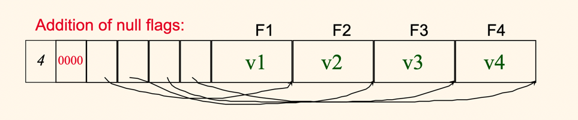
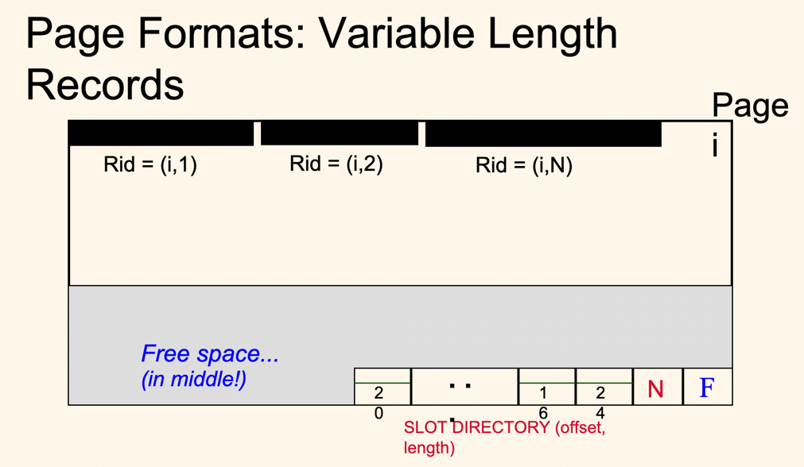

## Project 1 Report

### 1. Basic information
-Team#:
-GithubRepoLink:https://github.com/UCI-Chenli-teaching/cs222-winter22-godaaddanki
-Student1UCINetID: gaddanki
-Student1Name: Goda Devi Addanki

### 2. Internal Record Format
- Show your record format design.
Please find record format design as below

|num of fields| null bitmap| pointer1| pointer2| pointer3| fieldvalue1| fieldvalue2| fieldvalue3|

->first section of record stores number of fields
->second section stores null bitmap
->third section stores pointers to the value fields. The pointer is pointed to the end of the 
field value,as the start of pointer is known from offset values and from previous pointers
->fourth section stores actual field values

- Describe how you store a null field.
->In the record,null field is not stored in the filed values section.But in the pointer section,one pointer exists
for it, and it has same pointer value as the previous pointer,indirectly indicating that respective field is NULL

- Describe how you store a VarChar field.
->While reading the record,based on the type,if its varchar,first 4bytes indicate length of the varchar,
 so,based on the length,next num.of bytes are stored as varchar value,and pointer directory is updated as 
 Pointers give info about where is the end of the value

- Describe how your record design satisfies O(1) field access.
-> to access any record value, we can go to the respective pointer directly , as pointer location is based on the 
   index of the field i.e 4bytes+ num fileds* bytes+ field index*4bytes. 
-> From the pointer and previous pointer, we would know where the field value is actually stored and its end pointer, 
   so it's fixed time to access a field which is O(1)

### 3. Page Format
- Show your page format design.
-> Page format design I followed is same as professors suggestion. PLease find the below pic 

- Page grows from both start and end. Records are stored in starting of the page, at the end meta data about free space
 num of slots, pointers to each record start and each record's size is stored
- The info in meta helps to figure out if a new record can be fit into the page and if so , where should it be inserted
- records are stored contiguously in page

- Explain your slot directory design if applicable.
- Slot directory has two parameters - record pointer and record size as num of bytes 
- it is stored in the page end and new slot info is added as records keep adding
- left most 4bytes for pointer, right four bytes for length in each slot information unit

### 4. Page Management
- Show your algorithm of finding next available-space page when inserting a record.
1.Calculate the record size based on the recordDescripter and inout buffer format
2.Based on the record size, we can check each page's meta data (free space info), to 
  helps us figure out if a page can be inserted in it. 
3.first, check the latest page in the file for the available space for the record. 
4. if free space not avaiable in latest page, check everypage in the file for the required free space for the buffer
5. if none of the current pages has free space, then append a new page

- How many hidden pages are utilized in your design?
-> one hidden page used to store info about the 3 counters.

- Show your hidden page(s) format design if applicable
-> Hidden page has info about three counters - readpagecounter ,writepagecounter and appendpagecounter
-> three counters are unsigned int type 

### 5. Implementation Detail

- Other implementation details goes here.
PFM Hidden page implementation
->When then file is created, hidden page is added to it immediately
->when file is opened, the counter values from hidden page are loaded to instance variables and 
-> when file is closed, those are written back to the hidden page. 
-> In this way, we maintain correct counter values across various file openings

Null bitmap
->to check the null bit map, bitwise operation is used. Based on the index of the field , respective byte 
 info is obtained and shift operation to required bit is performed.

### 6. Member contribution (for team of two)
- Explain how you distribute the workload in team.
I worked as one-person team for the project

### 7. Other (optional)
- Freely use this section to tell us about things that are related to the project 1, but not related to the other sections (optional)

- Feedback on the project to help improve the project. (optional)