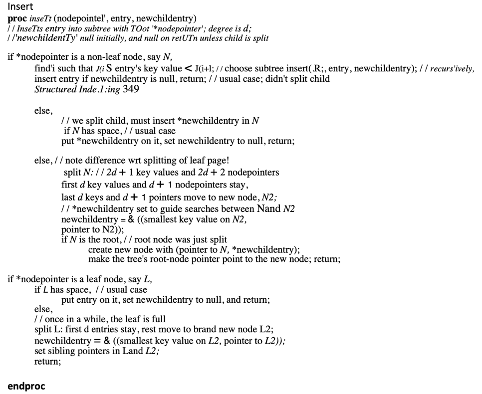

## Project 3 Report

### 1. Basic information
- Team #:
  - GithubRepoLink:https://github.com/UCI-Chenli-teaching/cs222-winter22-godaaddanki
  - Student1UCINetID: gaddanki
  - Student1Name: Goda Devi Addanki

### 2. Meta-data page in an index file
- Show your meta-data page of an index design if you have any. 
    - Meta-data page of index file is a dummy page which stores root node pagenum.
    - When ever root node gets changed ,dummy page also gets updated
    - Usual File Meta related to IO disk read/write/append count is stored in Hidden Page of the file, for which PFM based 
      design is used

### 3. Index Entry Format
- Show your index entry design (structure). 
  Index entry is stored in pairs wise like below
  - entries on internal nodes:  
    - LeftPageNumber|Key1|pageNumber1|Key2|pageNumber2
  
  - entries on leaf nodes:
    - Key1|RID.PageNum1|RID.SlotNum1|Key2|RID.PageNum2|RID.SlotNum2

### 4. Page Format
- Show your internal-page (non-leaf node) design.
  - PageMeta of non-leaf node i.e index and root nodes stores FreeSpace, Number of slots, node Type
  - Node Types - DummyNode = 0, RootNode = 1, IndexNode = 2, LeafNode = 3
  - THe four bytes of page areused to store leftpointer and rest all the slots have <Key, PageNUMber> pairs

- Show your leaf-page (leaf node) design.
  - PageMeta of non-leaf node i.e index and root nodes stores FreeSpace, Number of slots, Node Type,
    left Page number, right page number
  - all the slots have <Key, RID> pairs

### 5. Describe the following operation logic.
- Split
  - Followed Pseudo Code from TextBook
  

  - Split happens if current leaf node cannot accommodate new entry , we check freespace to decide it
  - Split starts from leafNode.If an entry is unable to fit in a leafNode, leafNode is split
   and New Node's first key and splitNode's pageNum is passed to parent index node in 
   recurssion through NumChildEntry which would be NULL default

- Parent Node checks 
  - in the index Node, we check if NumChildEntry is NULL, if its not null, it means child node is split
   so, we try to insert new entry to index node. 
  - if Index Node doesn't have enough space,then index node is also split
  - After split , we refill NumChildEntry with entry , where we split the index node
  - Again , parent index node checks NumChildEntry and this stops when NumChildEntry is set to NULL and root node is reached

- Rotation (if applicable)

- Merge/non-lazy deletion (if applicable)
I implemented Lazy deletion

- Duplicate key span in a page
  - In my Design , I made sure that Duplicates keys would be grouped together in one single page, if a page needs to be
   be split, then bundle of duplicate keys would be moved to either of the new or old leaf nodes, but
   bundle won't be split, this would ensure that index pages have unique keys.

- Duplicate key span multiple pages (if applicable)

### 6. Implementation Detail
- Have you added your own module or source file (.cc or .h)? 
  Clearly list the changes on files and CMakeLists.txt, if any.
  - NO, I didn't add any extra modules or files

- Other implementation details:

### 7. Member contribution (for team of two)
- Explain how you distribute the workload in team.
  - I worked as one-person team for the project

### 8. Other (optional)
- Freely use this section to tell us about things that are related to the project 3, but not related to the other sections (optional)

- Feedback on the project to help improve the project. (optional)
